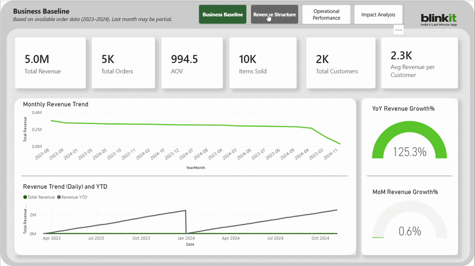
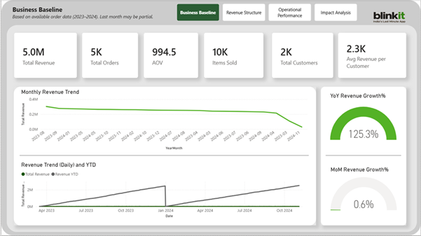
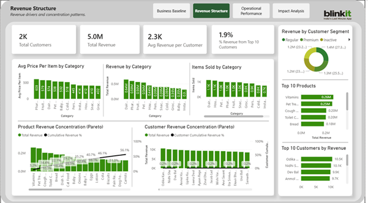
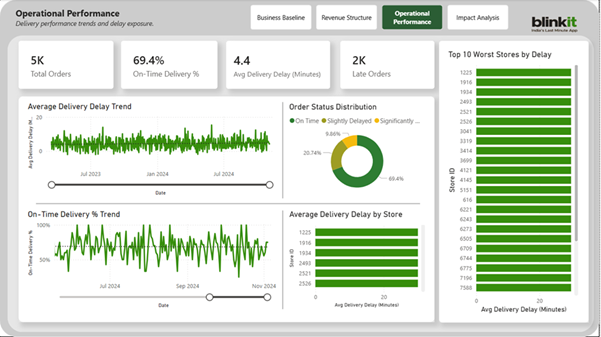
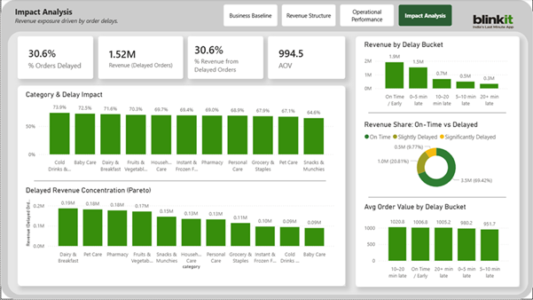
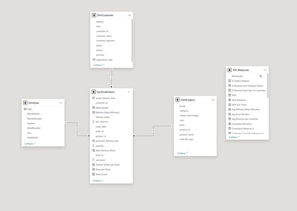

# Blinkit Delivery Delay Analysis  
## Investigating Why 30% of Delayed Orders Did Not Immediately Impact Revenue

This project demonstrates **hypothesis-driven analytics, semantic data modeling, and KPI-driven dashboard design using Power BI** to investigate operational risk hidden behind stable financial metrics.

---

# Project Overview

In quick commerce, **delivery speed is a core part of the value proposition**. Customers expect their orders to arrive within a promised time window, often within minutes.

While exploring a Blinkit sales dataset, I noticed an interesting operational pattern:

> **Nearly 30% of orders were delivered late.**

However, financial metrics did not reflect the same level of concern:

- Revenue remained stable  
- Average Order Value (AOV) did not decline  
- Customer revenue concentration was low  
- Product revenue distribution was diversified  

This raised a central analytical question:

**If such a significant portion of orders are delayed, why isn't revenue falling?**

This project investigates that contradiction by analyzing operational performance, revenue distribution, and customer purchasing behavior.

---

# Key Analytical Questions

The analysis focused on answering the following questions:

1. If 30% of orders are delayed, why does revenue remain stable?
2. Do delayed orders reduce transaction value?
3. Are delays concentrated in specific product categories?
4. Is revenue dependent on a small set of customers or products?
5. Do operational metrics reveal risks not visible in financial metrics?

---

# Key Insights

### Delay frequency was significant
Approximately **30.6% of orders were delivered late**, indicating persistent operational friction.

### Delays did not reduce transaction value
Revenue from delayed orders was **roughly proportional to delayed order share**, meaning delayed orders were not generating smaller baskets.

### Average Order Value remained stable
AOV stayed consistent across:

- On-time deliveries  
- Slight delays  
- Significant delays  

This suggests customers tolerated delivery delays in the short term.

### Delay exposure was systemic
Delay rates were **similar across product categories**, indicating a structural fulfillment issue rather than a category-specific problem.

### Financial metrics can hide operational risk
Revenue, AOV, and product distribution appeared healthy. However, nearly **one-third of revenue depended on delayed orders**, revealing operational exposure not immediately visible in financial KPIs.

---

# Dashboard Pages

The Power BI report is organized into four analytical views:

1. **Business Baseline** – Overall revenue health and performance metrics  
2. **Revenue Structure** – Customer and product concentration analysis  
3. **Operational Performance** – Delivery delays and operational reliability  
4. **Impact Analysis** – Testing whether delays impact revenue and order value  

---

# Dashboards

## Business Baseline

Shows high-level business health indicators including revenue trends, order volume, and AOV stability.

---

## Revenue Structure

Analyzes revenue concentration across customers, products, and categories to determine whether revenue depends heavily on a small subset of buyers or items.

---

## Operational Performance

Examines delivery performance including delay trends, order status distribution, and store-level delay exposure.

---

## Impact Analysis

Tests whether delivery delays affect financial performance by comparing revenue and Average Order Value across delay buckets.

---

# Data Model

The dataset was modeled using a **star schema semantic model** to ensure consistent metric definitions across dashboards.

### Fact Table

- `FactOrderItems` – transaction grain at order-item level

### Dimension Tables

- `DimDate`
- `DimCustomer`
- `DimProduct`

A centralized **KPI measures layer** was created to ensure that all dashboards reference consistent metric definitions.

All key metrics (revenue, AOV, delay percentages, concentration metrics) were implemented as reusable **DAX measures**, avoiding visual-level calculations and ensuring analytical consistency.

---

# Tools Used

- Power BI  
- DAX  
- Star schema data modeling  
- Analytical investigation and hypothesis testing  

---

# Dataset

This analysis uses the **Blinkit Sales Dataset** available on Kaggle.

The dataset contains:

- order-level transaction data  
- product information  
- customer attributes  
- delivery timestamps  
- order quantities and revenue  

Dataset source:  
(https://www.kaggle.com/datasets/akxiit/blinkit-sales-dataset)

---

# Medium Article

The full analytical narrative and investigation are documented in the Medium article:

**30% of Orders Are Delayed. Why Isn't Revenue Falling?**

(https://medium.com/@poojanair5919/30-of-orders-are-delayed-why-isnt-revenue-falling-b2c29bbebcda)

---

# Explore the Project

If you want to explore the project in more detail:

- Read the full analytical investigation on Medium:  
  **30% of Orders Are Delayed. Why Isn't Revenue Falling?**

- Open the Power BI report file located in the `pbix` folder to explore the dashboards and semantic model.

- Review the semantic model diagram in the `semantic-model` folder to understand how the star schema was designed.

---

# Project Objective

The goal of this project was to demonstrate how analytical investigation can reveal operational risks that may not yet appear in financial metrics.

By combining semantic data modeling, KPI-driven dashboards, and structured hypothesis testing, the analysis highlights how BI tools can surface early warning signals in operational data.
